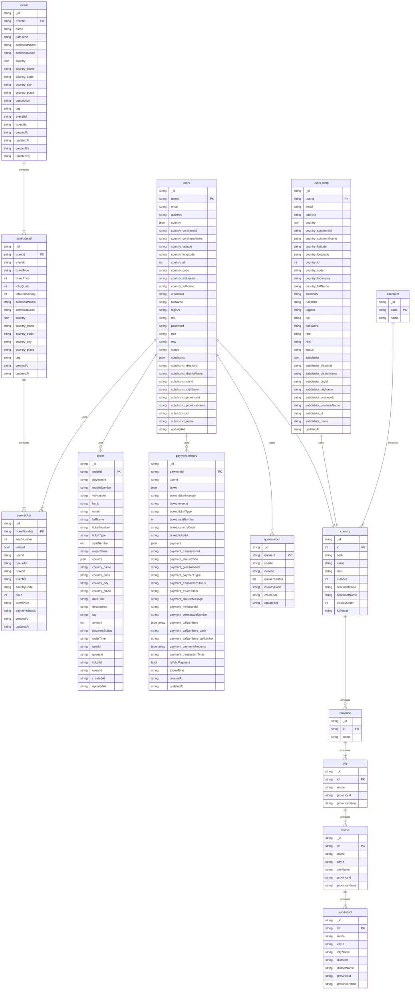

```mermaid
erDiagram
    users {
        string _id
        string userId PK
        string email
        string address
        json country
        string country_continentId
        string country_continentName
        string country_latitude
        string country_longitude
        int country_id
        string country_code
        string country_Indonesia
        string country_fullName
        string createdAt
        string fullName
        string loginAt
        string nik
        string password
        string role
        string rtrw
        string status
        json subdistrict
        string subdistrict_districtId
        string subdistrict_districtName
        string subdistrict_cityId
        string subdistrict_cityName
        string subdistrict_provinceId
        string subdistrict_provinceName
        string subdistrict_id
        string subdistrict_name
        string updatedAt
    }

    users-temp {
        string _id
        string userId PK
        string email
        string address
        json country
        string country_continentId
        string country_continentName
        string country_latitude
        string country_longitude
        int country_id
        string country_code
        string country_Indonesia
        string country_fullName
        string createdAt
        string fullName
        string loginAt
        string nik
        string password
        string role
        string rtrw
        string status
        json subdistrict
        string subdistrict_districtId
        string subdistrict_districtName
        string subdistrict_cityId
        string subdistrict_cityName
        string subdistrict_provinceId
        string subdistrict_provinceName
        string subdistrict_id
        string subdistrict_name
        string updatedAt
    }

    event {
        string _id
        string eventId PK
        string name
        string dateTime
        string continentName
        string continentCode
        json country
        string country_name
        string country_code
        string country_city
        string country_place
        string description
        string tag
        string eventUrl
        string ticketIds
        string createdAt
        string updatedAt
        string createdBy
        string updatedBy
    }

    ticket-detail {
        string _id
        string ticketId PK
        string eventId
        string ticketType
        int ticketPrice
        int totalQuota
        int totalRemaining
        string continentName
        string continentCode
        json country
        string country_name
        string country_code
        string country_city
        string country_place
        string tag
        string createdAt
        string updatedAt
    }

    bank-ticket {
        string _id
        string ticketNumber PK
        int seatNumber
        bool isUsed
        string userId
        string queueId
        string ticketId
        string eventId
        string countryCode
        int price
        string ticketType
        string paymentStatus
        string createdAt
        string updatedAt
    }

    order {
        string _id
        string orderId PK
        string paymentId
        string mobileNumber
        string vaNumber
        string bank
        string email
        string fullName
        string ticketNumber
        string ticketType
        int seatNumber
        string eventName
        json country
        string country_name
        string country_code
        string country_city
        string country_place
        string dateTime
        string description
        string tag
        int amount
        string paymentStatus
        string orderTime
        string userId
        string queueId
        string ticketId
        string eventId
        string createdAt
        string updatedAt
    }

    payment-history {
        string _id
        string paymentId PK
        string userId
        json ticket
        string ticket_ticketNumber
        string ticket_eventId
        string ticket_ticketType
        int ticket_seatNumber
        string ticket_countryCode
        string ticket_ticketId
        json payment
        string payment_transactionId
        string payment_statusCode
        string payment_grossAmount
        string payment_paymentType
        string payment_transactionStatus
        string payment_fraudStatus
        string payment_statusMessage
        string payment_merchantId
        string payment_permataVaNumber
        json_array payment_vaNumbers
        string payment_vaNumbers_bank
        string payment_vaNumbers_vaNumber
        json_array payment_paymentAmounts
        string payment_transactionTime
        bool isValidPayment
        string expiryTime
        string createdAt
        string updatedAt
    }

    queue-room {
        string _id
        string queueId PK
        string userId
        string eventId
        int queueNumber
        string countryCode
        string createdAt
        string updatedAt
    }

    subdistrict {
        string _id
        string id PK
        string name
        string cityId
        string cityName
        string districtId
        string districtName
        string provinceId
        string provinceName
    }

    city {
        string _id
        string id PK
        string name
        string provinceId
        string provinceName
    }

    continent {
        string _id
        string code PK
        string name
    }

    country {
        string _id
        int id PK
        string code
        string name
        string iso3
        int number
        string continentCode
        string continentName
        int displayOrder
        string fullName
    }

    district {
        string _id
        string id PK
        string name
        string cityId
        string cityName
        string provinceId
        string provinceName
    }

    province {
        string _id
        string id PK
        string name
    }

    country ||--o{ province: contains
    province ||--|{ city: contains
    city ||--|{ district: contains
    district ||--|{ subdistrict: contains
    event ||--|{ ticket-detail: contains
    ticket-detail ||--|{ bank-ticket: contains
    users ||--|{ bank-ticket: uses
    users ||--o{ order: uses
    users ||--o{ payment-history: uses
    users ||--o{ queue-room: uses
    users ||--|| country: uses
    users-temp ||--|| country: uses
    continent ||--|{ country: contains
```